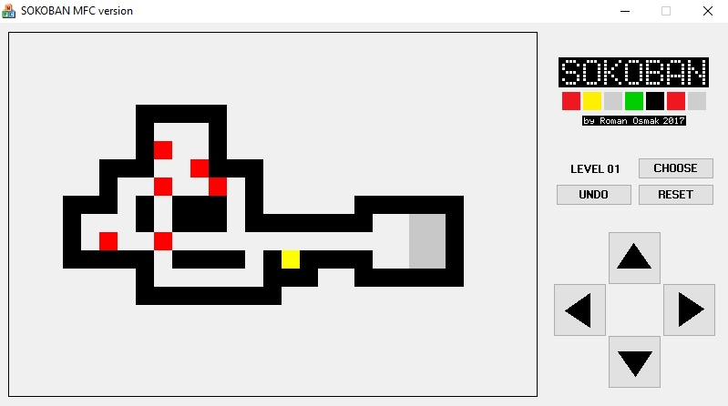

# Sokoban-MFC-source-code

Исходный код для [Sokoban-MFC](https://github.com/OsmakRoman/Sokoban-MFC.git).

Solution для Microsoft Visual Studio 2008.

Открывается и компилируется в Visual Studio 2017, только размер Release версии 1.98 MB против 357 KB в 2008 )

Игра написана на Visual C++  с использованием Microsoft Foundation Classes (MFC).

Содержит 60 полнофункциональных уровней.

Из бонусов:

* Возможность выбрать любой уровень
* Возможность отменить сделанный(е) ход(ы) вплоть до начала уровня
* Возможность начать уровень заново

#

#

 Тестировалась на Windows XP, 7, 10
